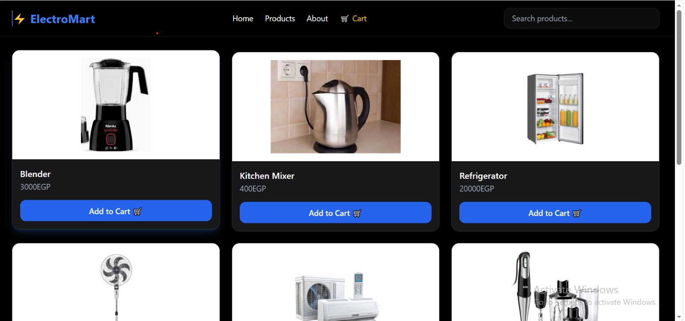
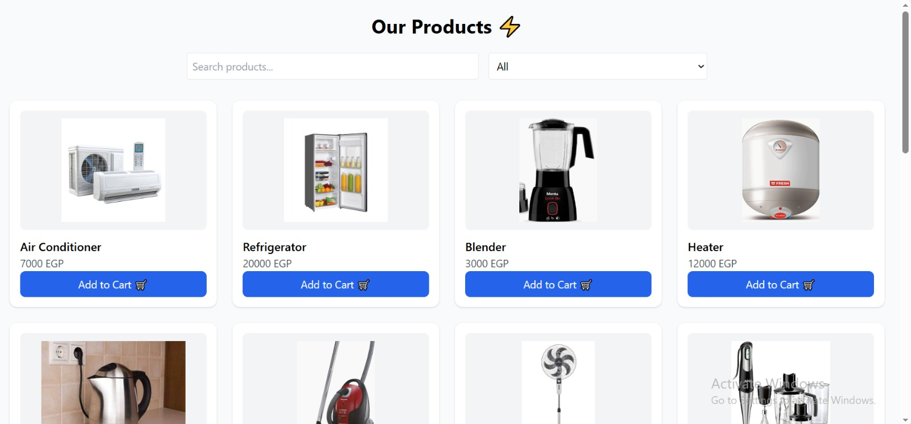
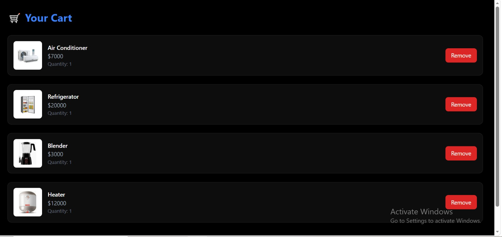
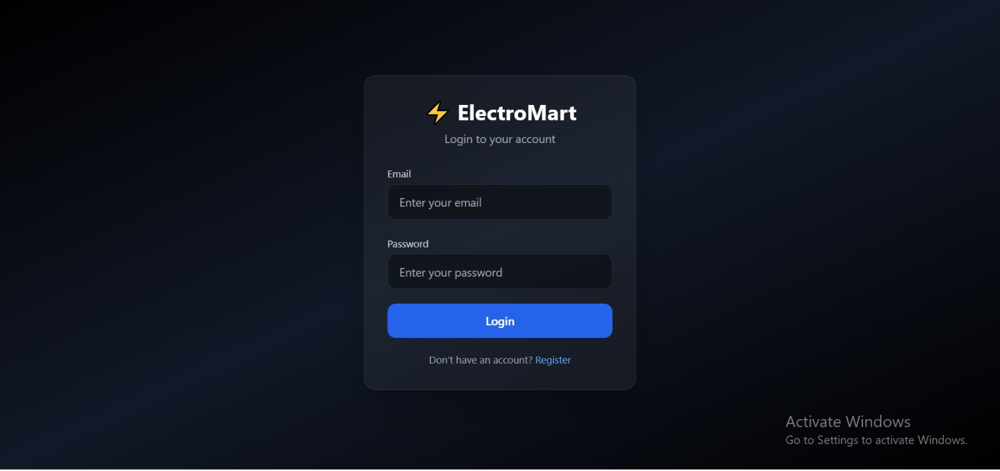
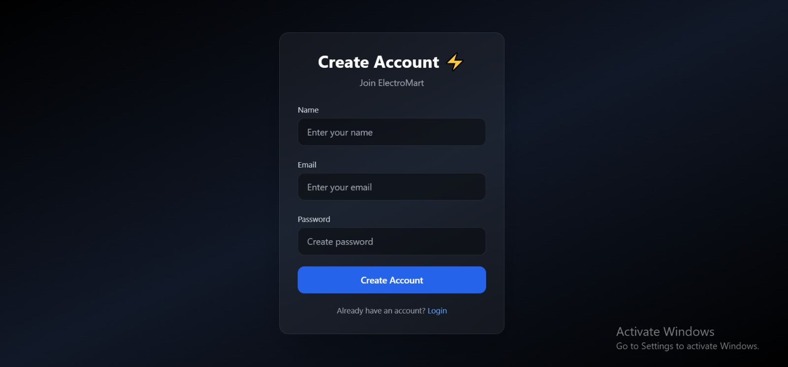
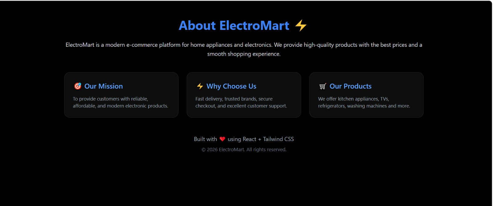

# ⚡ ElectroMart

A modern e-commerce website for electronics and home appliances built with **React JS** and **Tailwind CSS**.

## 🌐 Live Demo

🔗 https://electro-mart-orcin-gamma.vercel.app/

## 📌 About The Project

ElectroMart is a responsive e-commerce frontend application that allows users to browse electronic products, search for products, filter by category, and manage their shopping cart.

The project provides a modern shopping experience with a clean UI and smooth user interactions.

## 🚀 Features

- 🔐 User Login
- 📝 User Register
- 🏠 Home Page
- 🛒 Products Page
- 🔎 Search Products
- 🏷️ Filter Products by Category
- ➕ Add Products to Cart
- 🗑️ Remove Products from Cart
- 💾 Save Cart Data Using LocalStorage
- 📱 Fully Responsive Design

## 🛠️ Technologies Used

- React JS
- React Router DOM
- Tailwind CSS
- Vite
- JavaScript (ES6)
- LocalStorage

## 📂 Project Structure
## 📸 Screenshots

### 🏠 Home Page

### 🛍️ Products Page

### 🛒 Cart Page

### 🔐 Login Page

### 📝 Register Page

### 📄 About Page
